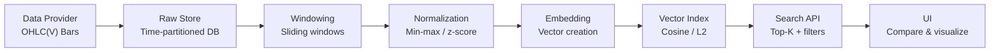

# Time‑Series Pattern Retrieval (RAG)

Explore historical chart analogs with time‑series embeddings. This project applies Retrieval Augmented Generation (RAG) ideas to OHLC(V) data so you can quickly find windows that “look like” recent market behavior.

> Research prototype only. Not a trading system or financial advice.

---

## Why
Analysts and researchers often want to locate historical segments that resemble today’s price action. Manual browsing is slow and biased. This system creates numerical embeddings of fixed‑length windows and performs fast similarity search to retrieve the closest historical matches at scale.

## What
- Ingest raw OHLC(V) bars for configured symbols and intervals
- Create sliding windows with configurable window_size and stride
- Normalize per window (min‑max by default) to focus on shape, not scale
- Embed each window into a dense vector and index in a vector store
- Query top‑K nearest neighbors with filters (symbol/date/exclusions)
- Visualize results with compact mini‑charts and metadata

## Key Features
- Configurable pipelines: windowing, normalization, embedding, and search
- Vector search with cosine or L2 metrics
- Filters for symbol inclusion/exclusion and date ranges
- “Similar to recent” and “Similar to selected range” flows in the UI
- API first: simple endpoints for ingestion, embedding builds, and search

---

## Architecture
The system is organized as a simple, reproducible data flow from raw bars to retrieval.



---

## Quickstart
This README focuses on the product behavior and API surface (see below). A minimal workflow:
1) Ingest raw bars for selected symbols and time ranges
2) Build embeddings for chosen window_size/stride/normalization
3) Query similar windows by recent data or by a specific historical range

### Example API Calls
Replace base URL with your deployment’s address.

```bash
# 1) Ingest raw bars
curl -X POST "$BASE_URL/ingest/run" \
  -H "Content-Type: application/json" \
  -d '{
    "symbols": ["AAPL", "AMZN"],
    "interval": "1d",
    "start": "2015-01-01",
    "end": "2025-01-01",
    "source": "provider-id"
  }'

# 2) Build embeddings
curl -X POST "$BASE_URL/embeddings/build" \
  -H "Content-Type: application/json" \
  -d '{
    "symbols": ["AAPL", "AMZN"],
    "interval": "1d",
    "window_size": 20,
    "stride": 5,
    "normalization": {"method": "minmax", "include_volume": false},
    "embedding_version": "v1",
    "metric": "cosine"
  }'

# 3a) Search similar to most recent N bars
curl -X POST "$BASE_URL/search/similar" \
  -H "Content-Type: application/json" \
  -d '{
    "query": {"byRecent": {"symbol": "AAPL", "interval": "1d", "window_size": 20}},
    "topK": 20,
    "filters": {"includeSymbols": ["AAPL", "AMZN"], "excludeDateWindow": {"before": 10, "after": 10}}
  }'

# 3b) Search similar to a historical range
curl -X POST "$BASE_URL/search/similar" \
  -H "Content-Type: application/json" \
  -d '{
    "query": {"byRange": {"symbol": "AMZN", "interval": "1d", "start": "2020-03-01", "end": "2020-04-01"}},
    "topK": 20,
    "filters": {"excludeSymbols": ["AMZN"], "dateRange": {"start": "2010-01-01", "end": "2024-12-31"}}
  }'
```

---

## Configuration
- window_size: integer (e.g., 5, 20, 100)
- stride: integer step size (e.g., 1–10)
- normalization: { method: minmax|zscore|logreturns|none, include_volume: boolean }
- metric: cosine|l2
- filters: includeSymbols / excludeSymbols / dateRange
- overlap exclusion: prevent trivial matches near the query window
- embedding_version: tag to ensure reproducibility and compatibility

---

## Data Model (Baseline)
### Raw Bars
- symbol, ts, open, high, low, close, volume?, interval, source

### Window Embeddings
- symbol, start_ts, end_ts, interval, window_size, stride, normalization, embedding_version, vector, metric, created_at

---

## Quality & Evaluation
- Visual plausibility: top results generally resemble the query window
- Synthetic tests: canonical shapes (e.g., V‑shape, channels) retrieve similar shapes
- Stability: scores consistent across rebuilds with same embedding_version
- Score calibration: similarity ∈ [0,1] and monotonic with distance

---

## Roadmap
- M1: Ingestion + raw storage with one provider adapter; health checks
- M2: Windowing + normalization + embedding pipeline; versioned metadata
- M3: Vector indexing + top‑K search; filters; score calibration
- M4: UI (recent/range views); overlay compare; disclaimers
- M5: Observability; synthetic tests; relevance review loop
- M6: Local‑first packaging; docs and examples

---

## FAQ
- Is this a trading system?
  - No. It’s a research tool for exploring historical analogs and patterns.
- Why normalize per window?
  - To emphasize shape over absolute price/scale; other strategies are configurable.
- Can I use different embedding models?
  - Yes. The embedding interface is pluggable; swap in deep encoders as desired.

---

## Contributing
Contributions are welcome. Please propose changes via issues and pull requests, and keep the research‑only disclaimer intact.

## License
TBD

## Disclaimer
This software is for research and educational purposes only. It does not constitute financial advice or an offer to trade. Use at your own risk.
